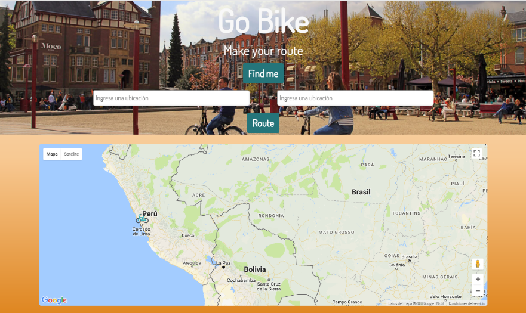
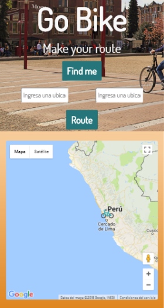

# Easy-Vreco
---
## Objetivo

Utilizar la geolocalización y la api de goolge maps para elaborar una aplicación que encuentre la posición actual y traze un ruta entre dos puntos.

## Especificaciones de Desarrollo

* La página principal es denominada `index.html` en el cual se encuentra inicializada la aplicación.

* En la carpeta `css` se encuentra el archivo `main.css` donde se han agregado los  estilos necesarios para el proyecto.

* El framework utilizado es Bootstrap 4.

* En la carpeta `assets` se encuentra la carpeta `images` donde estan las imágenes necesarias para el proyecto.

* Esta web utiliza 1 tipografía :   `Sains`.

* Los íconos se obtuvieron de  [IcoMoon](https://icomoon.io/app/) y de font-awesome.

* En el desarrollo del proyecto se han utilizado diferentes tipos de efectos sobre algunos títulos e imágenes, todo esto especificado en la hoja de estilos main.css.

### Versión desktop

;

### Versión Mobile

;

#### Desarroladoras

* **Carla Centeno:** [GitHub Account](https://github.com/carlacentenor).
* **Alejandra Cabrera:** [GitHub Account](https://github.com/AlejandraCP).  

Realizado por Carla Centeno y Alejandra Cabrera.